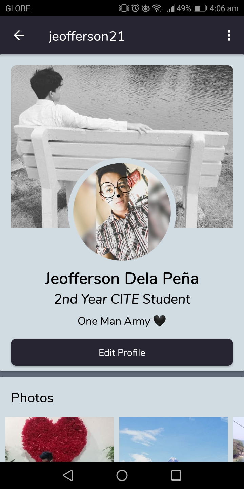

# FLAMES-UPang-Online-Hub

Flames is a fully functional social app that is exclusively for PHINMA - University of Pangasinan. After registration, an admin will have to confirm first if the created account indeed belongs to a student or a teacher of the university. Until an admin approves the account, the user will not be able to access the app. This is to prevent other people that's not part of the university from using the application. Users have their own customizable profile page and they are free to post, comment, reply to comment, like, etc. This also serves as a platform for the campus to post announcements and updates about the latest happenings in the university.

# **Screenshots**

      
